## 本アプリのアーキテクチャー



## 実現する機能

- ユーザ認証
- bookmark urlの登録
- bookmarkの削除
- tagの登録(最大10個まで)
- tag名の変更
- マークダウンの保存

※tagの削除は現時点(3/10)では実装する予定なし

## 使用したAWSサービス

- cognito
- DynamoDB
- API Gateway
- Lambda
- S3

## ユーザ認証について

- ユーザ名はシステム全体でユニークになる -> 重複した名前は登録できない
- サインアップに必要な情報はユーザ名、emailアドレス
- 入力されたemailアドレスに認証コードを送付、アプリに入力してもらうことで登録を行う
- パスワードの再登録は現時点(3/10)では実装する予定なし

## tagの保存

### ユーザごとのtagを保存するDynamoDBテーブル

|     |          | sample                               | 
| --- | -------- | ------------------------------------ | 
| PK  | userName | hiroki                               | 
| SK  | tagID    | 8e6e97e6-260a-4d94-8f8b-da93efac4f13 | 
|     | tagName  | React                                | 

- idの生成にはUUID v4を使用する

※　同名のタグを保存された場合、tagNameのみだと識別ができなくなるためIDを付与

### ブックマークされたURLとタグを保存するDynamoDBテーブル

|     |                | sample                                                                       | 
| --- | -------------- | ---------------------------------------------------------------------------- | 
| PK  | userName       | hiroki                                                                       | 
| SK  | bookmarkID     | 86a7964f-4a23-40e9-a33b-dc41a98d5df3                                         | 
|     | bookmarkURL    | https://github.com/daiki-kon                                                 | 
|     | registeredDate | 2014-10-10T13:50:40+09:00                                                    | 
|     | tagIDs         | [9c0f5738-6319-45cc-827b-c97471bae858, 8e6e97e6-260a-4d94-8f8b-da93efac4f13] | 

- 日時のフォーマットにはISO 8601を使用。タイムゾーンは日本

##　マークダウンの保存

S3上に.mdとして保存。  
ファイル名はuserName/bookmarkIDとする。

## API

本システムに必要なAPIは以下の通り。

- bookmark　URLの登録 (POST)
- bookmarkの削除 (DELETE)
- bookmark一覧の取得(GET)
- tagの登録 (POST)
- tag名の変更 (PUT)
- tagの取得(GET)

## APIリソース

### [post] book mark
desc: ブックマークの登録をする

path: https://domain/user/{userName}/bookmark

request:
```.json
{
  "bookmarkURL": "https://github.com/daiki-kon",
  "tagsIDs": ["9c0f5738-6319-45cc-827b-c97471bae858", "8e6e97e6-260a-4d94-8f8b-da93efac4f13"]
}
```

response: 成功 -> 201, すでに登録済み -> 409, 何らかのエラー発生 -> 500
```.json
{
  "data":{
    "bookmarkID": "86a7964f-4a23-40e9-a33b-dc41a98d5df3",
    "registeredDate": "2014-10-10T13:50:40+09:00"
  }
}
```

### [delete] book mark
desc: ブックマークの削除

path: https://domain/user/{userName}/bookmark/{bookmarkID}

response: 成功 -> 204,　削除対象がない -> 404, 何らかのエラー発生 -> 500

### [get] book mark
desc: ブックマークの一覧とメタデータ(tag, 登録日時)を取得

path: https://domain/user/{userName}/bookmarks

response: 成功 -> 200, 何らかのエラー発生 -> 500
```.json
{
  "data": [
    {
      "id": "86a7964f-4a23-40e9-a33b-dc41a98d5df3",
      "url": "https://github.com/daiki-kon",
      "registeredDate": "2014-10-10T13:50:40+09:00",
      "tags": [ "React", "Typescript" ]
    }
  ]
}
```

### [post] tag
desc: タグの登録をする

path: https://domain/user/{userName}/tag

request:
```.json
{
  "bookmarkURL": "https://github.com/daiki-kon"
  "tagsIDs": ["9c0f5738-6319-45cc-827b-c97471bae858", "8e6e97e6-260a-4d94-8f8b-da93efac4f13"]
}
```

response: 成功 -> 201, すでに登録済み -> 409, 何らかのエラー発生 -> 500
```.json
{
  "data":{
    "tagID": "8e6e97e6-260a-4d94-8f8b-da93efac4f13"
  }
}
```

### [put]] tag
desc: タグの名前を変更

path: https://domain/user/{userName}/tag/{tagID}

request:
```.json
{
  "newName": "Next.js"
}
```

response: 成功 -> 201, すでに登録済み -> 409, 何らかのエラー発生 -> 500

### [get] tag
desc: タグの一覧を取得

path: https://domain/user/{userName}/tags

response: 成功 -> 200, 何らかのエラー発生 -> 500
```.json
{
  "data": [
    {
      "tagID": "8e6e97e6-260a-4d94-8f8b-da93efac4f13",
      "tagName": "React"
    }
  ]
}
```

参考にしたサイト
https://developer.mozilla.org/ja/docs/Web/HTTP/Status
https://qiita.com/uenosy/items/ba9dbc70781bddc4a491#%E6%88%90%E5%8A%9F%E3%81%97%E3%81%9F%E5%A0%B4%E5%90%88