## 本アプリのアーキテクチャー

## 実現する機能

- ユーザ認証
- bookMark urlの登録
- bookMarkの削除
- tagの登録(最大10個まで)
- tag名の変更
- マークダウンの保存

※tagの削除は現時点(3/10)では実装する予定なし

## 使用したAWSサービス

- cognito
- DynamoDB
- API Gateway
- Lambda
- S3

## ユーザ認証について

- ユーザ名はシステム全体でユニークになる -> 重複した名前は登録できない
- サインアップに必要な情報はユーザ名、emailアドレス
- 入力されたemailアドレスに認証コードを送付、アプリに入力してもらうことで登録を行う
- パスワードの再登録は現時点(3/10)では実装する予定なし

## tagの保存

### ユーザごとのtagを保存するDynamoDBテーブル

|     |          | sample                               | 
| --- | -------- | ------------------------------------ | 
| PK  | userName | hiroki                               | 
| SK  | tagID    | 8e6e97e6-260a-4d94-8f8b-da93efac4f13 | 
|     | tagName  | React                                | 

- idの生成にはUUID v4を使用する

※　同名のタグを保存された場合、tagNameのみだと識別ができなくなるためIDを付与

### ブックマークされたURLとタグを保存するDynamoDBテーブル

|     |                | sample                                                                       | 
| --- | -------------- | ---------------------------------------------------------------------------- | 
| PK  | userName       | hiroki                                                                       | 
| SK  | bookMarkID     | 86a7964f-4a23-40e9-a33b-dc41a98d5df3                                         | 
|     | bookMarkURL    | https://github.com/daiki-kon                                                 | 
|     | registeredDate | 2014-10-10T13:50:40+09:00                                                    | 
|     | tagIDs         | [9c0f5738-6319-45cc-827b-c97471bae858, 8e6e97e6-260a-4d94-8f8b-da93efac4f13] | 

##　マークダウンの保存

S3上に.mdとして保存。  
ファイル名はbookMarkIDとする。

## API

本システムに必要なAPIは以下の通り。

- bookMark　URLの登録 (POST)
- bookMarkの削除 (DELETE)
- tagの登録 (POST)
- tag名の変更 (PUT)
